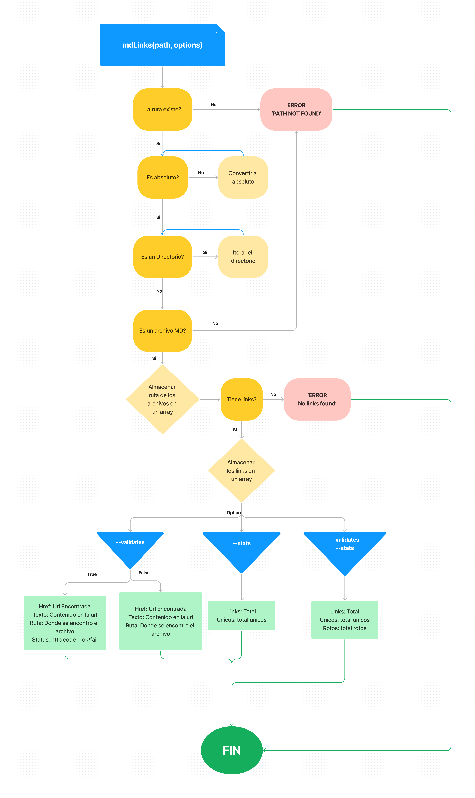
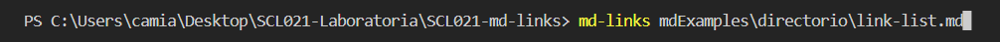
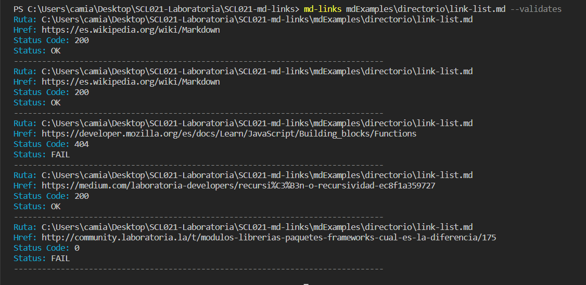
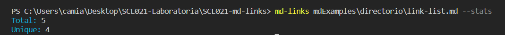
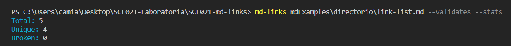

# Md-Links

Libreria creada con Node.js. Su funcion principal es extraer links de un archivo .md para luego analizar su estado. Tambien podrás consultar otras estadisticas como la cantidad de links unicos o el total.

## Diagrama de Flujo
Para desarrollar la libreria se utilizó el siguiente diagrama de flujo

## Como Utilizar la Libreria:
Para ejecutar la libreria deberás utilizar el comando 'md-links' en la terminal, seguido de la ruta del archivo que deseas analizar.
Esta puede ser relativa o absoluta

Es posible ejecutar un par de opciones dependiendo de los datos que quieras recibir:

#### Opcion: --validates
Al ejecutar esta opcion, recibiras informacion detallada de los links analizados.
Tal como muestra el siguiente ejemplo:

#### Opcion: --stats
La opcion '--stats', por otro lado, te dará informacion mas general sobre los links encontrados.

#### Opcion: --validates --stats
Por ultimo, es posible ejecutar ambas opciones a la vez, esto te entrega un analisis resumido de los links.

